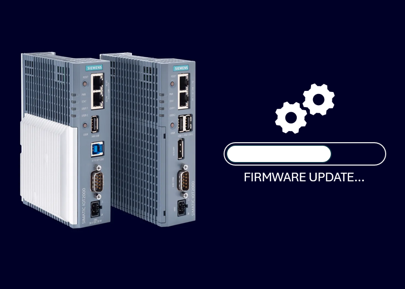
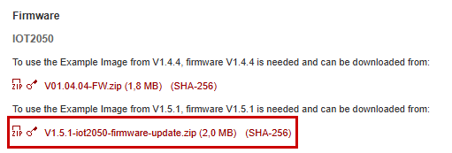

# **IOT2050-Firmware-Update to V1.5.x**

These instructions will show you the required steps update your firmware to version V1.5.x.

- [**IOT2050-Firmware-Update to V1.5.x**](#iot2050-firmware-update-to-v15x)
  - [**Requirements**](#requirements)
    - [**Hardware**](#hardware)
    - [**Software**](#software)

___

To be able to use the Example Image V1.5.x, it is required to update the firmware of the following devices:

- IOT2050 Basic (6ES7 647-0BA00-0YA2)
- IOT2050 Advanced (6ES7 647-0BA00-1YA2)
- IOT2050 M.2 (6ES7647-0BB00-1YA2)
- IOT2050 SM (6ES7 647-0BA00-1AA2)

To update to the compatible firmare version V1.5.x the Example Images from V1.1.1 can be used.

> After the update to firmware version V1.5.x it is not possible to boot the following operating systems:

- Example Image V1.0.2
- Industrial OS V2.x

Example Image from V1.1.1 can be used with the new firmware version.

## **Requirements**

### **Hardware**

This chapter contains the hardware required for the firmware update.

- **SIMATIC IOT2050 Basic / Advanced / SM / M.2:**
  - SIMATIC IOT2050 Basic (6ES7647-0BA00-0YA2)
  - SIMATIC IOT2050 Advanced (6ES7647-0BA00-1YA2)
  - the SIMATIC IOT2050 M.2 (6ES7647-0BB00-1YA2)
  - SIMATIC IOT2050 SM (6ES7 647-0BA00-1AA2)
- **µSD card / USB flash drive / eMMc:** To boot from Example Image to perform the update, either a µSD card or USB drive is required. For the IOT2050 Advanced the internal eMMc can be used as well.
- **Power supply:** To run the SIMATIC IOT2050 a power supply is required. This power supply must provide between 12 and 24V DC.
- **Engineering Station:** To get remote access to the SIMATIC IOT2050 and to transfer files an Engineering station is required. In this example a PC with Windows 11 is used.
- **Ethernet cable:** For an Ethernet Connection between the Engineering Station and the SIMATIC IOT2050 to establish a SSH connection an Ethernet cable is required.

### **Software**

This chapter contains the software required for the firmware update.

- **Example Image** V1.5x (recommended) - The firmware update cannot be performed with Example Image V1.0.2 or Industrial OS V2.x.
- **Firmware Version** at least V1.1.1 - The Example Image V1.5.x is not compatible with firmware version V1.0. Please use an additional SD card to perform the update if you want to keep your current image.
- **ssh client:** To get remote access to the SIMATIC IOT2050 software is required. We always use [MobaXterm](https://mobaxterm.mobatek.net/) as it also allows to copy files from the Engineering Station to the IOT2050 per Drag & Drop.
- **Firmware Update tool and firmware file** - The required `firmware-update-tool` is already part of the Example image V1.5.x. The `Firmware Update File` can be downloaded at the [IOT2050 Download Page](https://support.industry.siemens.com/cs/document/109741799/downloads-for-simatic-iot20x0)

> We always recommend using the latest version of the Firmware Version V1.5.x.

